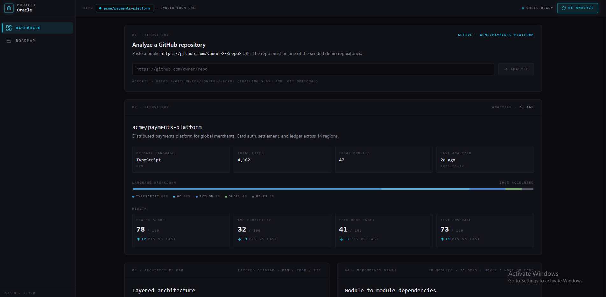
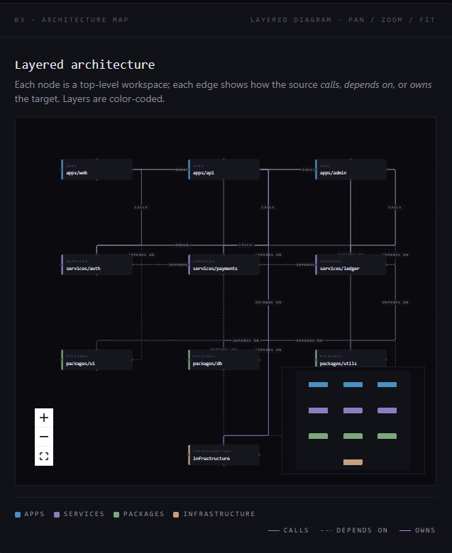
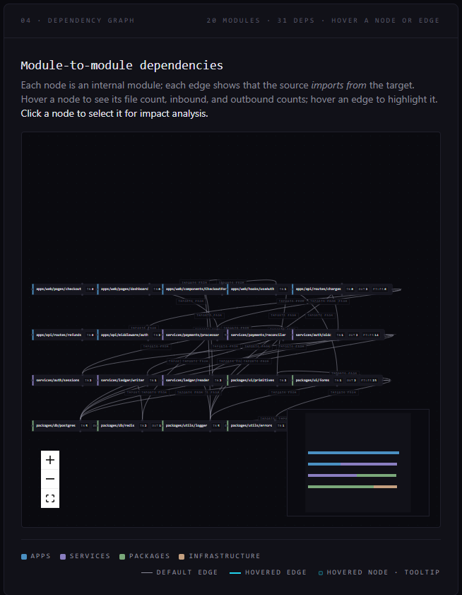
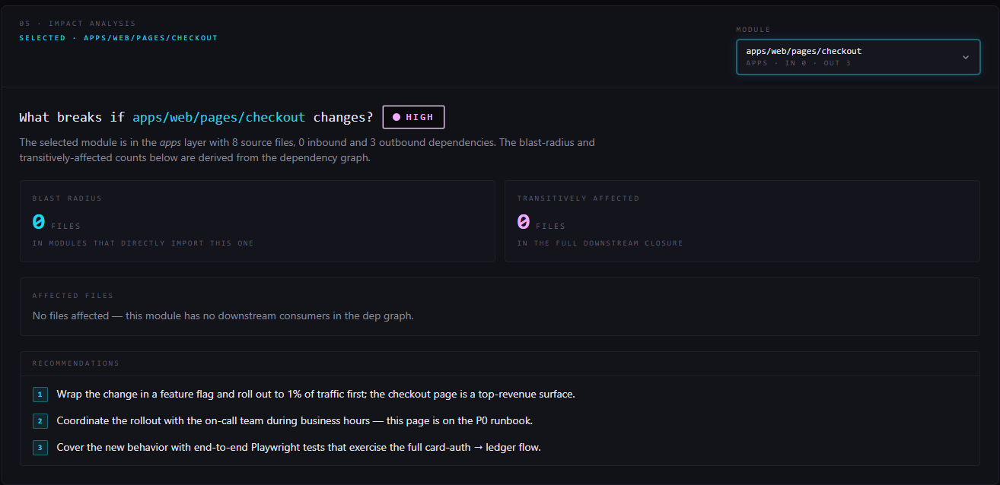
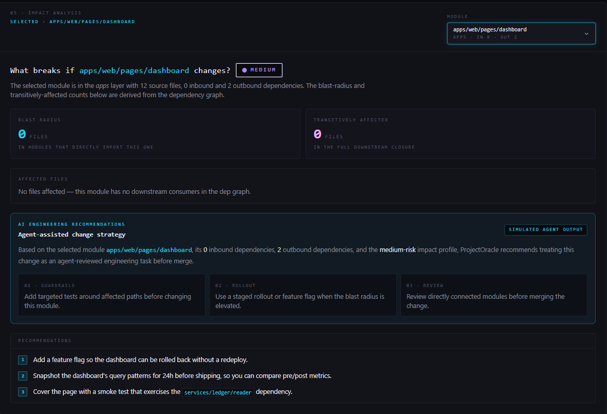
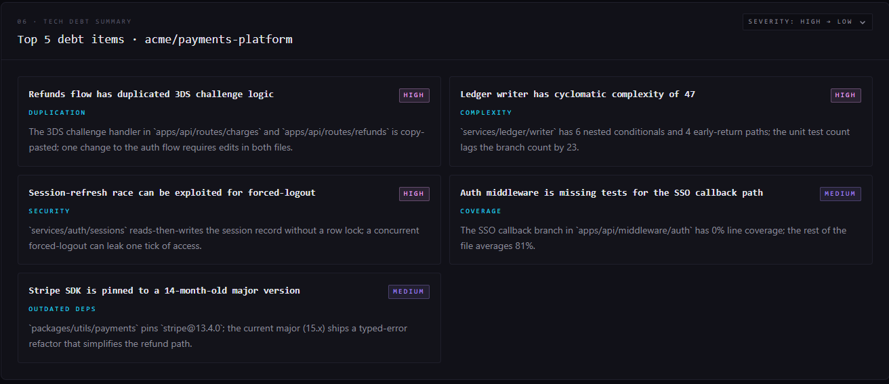
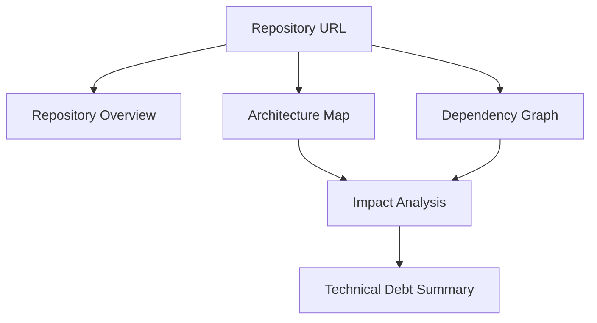

# ProjectOracle

ProjectOracle is an AI-powered repository intelligence dashboard for understanding software architecture, dependencies, impact risk, and technical debt.

Originally developed as ProjectOracle during the CyOps build process, ProjectOracle helps developers quickly understand unfamiliar codebases by combining architecture visualization, dependency mapping, impact analysis, and technical debt inspection into a single interactive dashboard.

---

## Problem

Developers joining an unfamiliar repository often spend hours understanding architecture, dependencies, and the potential impact of changes before they can contribute safely.

Common questions include:

* How is this repository structured?
* Which modules depend on each other?
* What breaks if a module changes?
* Which components are the highest risk?
* Where is technical debt concentrated?

Answering these questions typically requires extensive manual code exploration.

---

## Solution

ProjectOracle provides a visual repository intelligence dashboard that combines architecture mapping, dependency analysis, impact assessment, and technical debt inspection into a single interface.

The dashboard enables developers to:

* Understand repository structure quickly
* Explore module relationships visually
* Estimate change impact before refactoring
* Identify technical debt hotspots
* Navigate unfamiliar codebases with confidence

---

## Features

### Repository Overview

Displays repository metadata, language breakdown, health metrics, complexity indicators, technical debt index, and test coverage.

### Architecture Map

Visualizes the high-level system architecture using layered React Flow diagrams.

Features:

* Architecture layers
* Service relationships
* Visual dependency paths
* Interactive exploration

### Dependency Graph

Shows module-to-module dependencies and lets users inspect repository structure visually.

Features:

* Interactive graph navigation
* Module relationship visualization
* Dependency direction tracking
* URL-synced selection state

### Impact Analysis

Helps answer:

> What breaks if this module changes?

The panel displays:

* Risk level
* Blast radius
* Directly affected files
* Transitively affected files
* Engineering recommendations

### Technical Debt Summary

Lists the most significant technical debt items per repository, including:

* Complexity issues
* Code duplication
* Coverage gaps
* Outdated dependencies
* Security concerns

### Multi-Repository Demo

ProjectOracle currently supports:

* `acme/payments-platform`
* `stellar/orbit-ui`

Unknown repositories are handled gracefully through a fallback state.

### Responsive Design

The dashboard remains usable down to 1024px width.

Responsive behavior:

* Sidebar collapses to an icon rail below 1024px
* React Flow panels stack vertically below 1024px
* Layout remains optimized on desktop and laptop screens

---

## Screenshots

The following screenshots demonstrate the core repository intelligence capabilities provided by ProjectOracle.

### Dashboard Overview



High-level repository metrics including health score, complexity, technical debt index, language breakdown, and test coverage.

### Architecture Map



Interactive layered architecture visualization showing relationships between applications, services, packages, and infrastructure components.

### Dependency Graph



Visual dependency graph for exploring module relationships and understanding repository structure.

### Impact Analysis



Change impact assessment showing blast radius, risk level, affected files, and engineering recommendations.

### AI Engineering Recommendations



Agent-assisted engineering guidance generated from dependency relationships, risk levels, blast-radius analysis, and repository intelligence signals.

### Technical Debt Summary



Prioritized technical debt findings including complexity hotspots, duplication issues, coverage gaps, and outdated dependencies.

---

## Demo Routes

```bash
http://localhost:3000

http://localhost:3000/?repo=acme/payments-platform

http://localhost:3000/?repo=stellar/orbit-ui

http://localhost:3000/?repo=foo/bar
```

---

## Architecture



### System Components

```text
Repository URL
      │
      ▼
Repository Analysis
      │
 ┌────┼────┐
 ▼    ▼    ▼
Architecture Map
Dependency Graph
Repository Overview
      │
      ▼
Impact Analysis
      │
      ▼
Technical Debt Summary
```

### Architecture Overview

ProjectOracle follows a panel-based architecture built on Next.js 14 and TypeScript. Repository data is loaded from a deterministic mock dataset and shared across all analysis views, ensuring reproducible results and consistent demonstrations.

The dashboard is organized into five primary analysis modules:

* Repository Overview
* Architecture Map
* Dependency Graph
* Impact Analysis
* Technical Debt Summary

### Component Structure

```text
app/
└── page.tsx

components/
├── panels/
│   ├── RepositoryOverview
│   ├── ArchitectureMap
│   ├── DependencyGraph
│   ├── ImpactAnalysis
│   └── TechnicalDebtSummary
│
├── shell/
│   ├── Sidebar
│   └── TopBar
│
└── ui/
```

### Analysis Flow

1. The user selects a repository through the URL parameter.
2. Repository metadata and health metrics are loaded.
3. Architecture Map visualizes high-level system layers.
4. Dependency Graph displays module-to-module relationships.
5. Impact Analysis calculates blast radius and affected modules.
6. Technical Debt Summary highlights the most important engineering risks.

### Performance Strategy

Architecture Map and Dependency Graph are rendered using React Flow and loaded through dynamic imports to reduce the initial JavaScript bundle size and improve Lighthouse performance.

Repository selection and module selection are synchronized through URL parameters, enabling reproducible analysis views and direct linking to specific repository states.

This architecture allowed ProjectOracle to achieve a Lighthouse Performance score of **100/100** while maintaining responsive graph-based visualizations and a modular dashboard structure.

---

## Tech Stack

* Next.js 14
* TypeScript
* Tailwind CSS
* React Flow
* pnpm

---

## Performance

Production build and Lighthouse audits were verified during final acceptance.

### Lighthouse Performance

| Repository             | Score     |
| ---------------------- | --------- |
| acme/payments-platform | 100 / 100 |
| stellar/orbit-ui       | 100 / 100 |

### Core Web Vitals

* First Contentful Paint (FCP): 0.8s
* Largest Contentful Paint (LCP): 1.8s
* Total Blocking Time (TBT): 0–20ms
* Cumulative Layout Shift (CLS): 0
* Speed Index: 0.8s

### Validation Results

* pnpm build ✅
* pnpm lint ✅
* TypeScript validation ✅
* Production deployment verified ✅

---

## Demo Repositories

### acme/payments-platform

Mock fintech payment platform demonstrating layered architecture, service boundaries, and dependency analysis.

### stellar/orbit-ui

Mock design-system repository demonstrating component relationships, package dependencies, and UI-focused architecture.

---

## Getting Started

Install dependencies:

```bash
pnpm install
```

Run development server:

```bash
pnpm dev
```

Run production build:

```bash
pnpm build
pnpm start
```

Open:

```bash
http://localhost:3000
```

---

## Agent Workflow

ProjectOracle follows a structured repository intelligence workflow that transforms repository metadata into actionable engineering insights.

```text
Repository URL
      │
      ▼
Repository Analysis
      │
      ▼
Dependency Extraction
      │
 ┌────┼────┬────┐
 ▼    ▼    ▼    ▼
Repository Overview
Architecture Map
Dependency Graph
Impact Analysis
      │
      ▼
Technical Debt Summary
```

### Workflow Stages

1. **Repository Analysis**
   - Load repository metadata and project structure.
   - Collect language, module, and file statistics.

2. **Dependency Extraction**
   - Build relationships between modules and components.
   - Identify architecture boundaries and dependency flows.

3. **Architecture Mapping**
   - Visualize high-level application, service, package, and infrastructure layers.

4. **Impact Analysis**
   - Estimate blast radius when a module changes.
   - Surface affected files and engineering recommendations.

5. **Technical Debt Detection**
   - Highlight complexity hotspots.
   - Detect duplication, coverage gaps, and outdated dependencies.

This workflow provides developers with a fast way to understand unfamiliar repositories and evaluate engineering risk before making changes.

## AI-Assisted Engineering Workflow

ProjectOracle includes an AI recommendation layer that transforms repository analysis into engineering guidance.

The system evaluates:

- Dependency relationships
- Module risk levels
- Blast radius
- Downstream impact

and generates actionable recommendations for rollout strategy, testing priorities, and code review focus areas.

This workflow demonstrates how repository intelligence can be combined with agent-assisted engineering decision support.

## MCP Server

ProjectOracle includes a lightweight MCP (Model Context Protocol) server implementation that exposes repository intelligence tools for AI agents.

### Available MCP Tools

- `list_demo_repositories`
- `get_repository_overview`
- `get_architecture_map`
- `get_dependency_graph`
- `get_impact_analysis`
- `get_technical_debt`

### Running the MCP Server

```bash
pnpm --dir mcp-server build
pnpm --dir mcp-server start
```

### MCP Workflow

```text
GitHub Repository
        │
        ▼
MCP Repository Server
        │
        ▼
ProjectOracle Dashboard
        │
 ┌──────┼──────┬──────┐
 ▼      ▼      ▼      ▼
Architecture
Dependencies
Impact Analysis
Technical Debt
        │
        ▼
AI Engineering Recommendations
```

The MCP server exposes repository analysis capabilities over stdio and enables AI agents to query repository architecture, dependencies, impact reports, and technical debt findings programmatically.

## Built with CyOps

ProjectOracle was developed using CyOps multi-agent workflows.

Development lifecycle:

1. Planning
2. Acceptance criteria generation
3. Iterative implementation
4. Automated review cycles
5. Responsive layout verification
6. Lighthouse performance validation
7. Final acceptance verification

CyOps was used throughout the project to accelerate planning, implementation, validation, and documentation while maintaining engineering quality and consistency.

### Project Statistics

* 12 Acceptance Criteria completed
* 15 implementation/review iterations
* Lighthouse Performance: 100/100
* Production build verified
* No open blocking issues

CyOps was used for planning, implementation, review, validation, and project completion tracking.

---

## Acceptance Criteria Status

| AC    | Status   |
| ----- | -------- |
| AC-1  | Complete |
| AC-2  | Complete |
| AC-3  | Complete |
| AC-4  | Complete |
| AC-5  | Complete |
| AC-6  | Complete |
| AC-7  | Complete |
| AC-8  | Complete |
| AC-9  | Complete |
| AC-10 | Complete |
| AC-11 | Complete |
| AC-12 | Complete |

---

## Project Status

✅ MVP Complete

✅ Production Build Verified

✅ Lighthouse Performance Verified

✅ Responsive Layout Verified

✅ Acceptance Criteria Complete

ProjectOracle is ready for demonstration and submission.

## Future Improvements

- Live GitHub repository ingestion and analysis
- Real-time dependency tracking
- MCP server integration for AI agent workflows
- AI-assisted refactoring recommendations
- Multi-repository comparison and benchmarking
